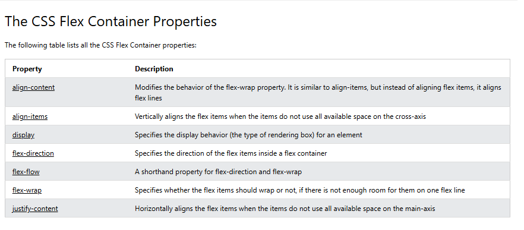
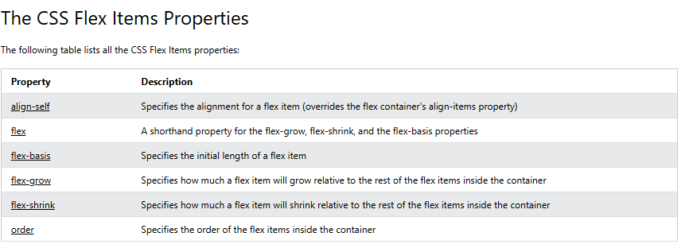

https://css-tricks.com/snippets/css/a-guide-to-flexbox/





Responsiveness:
```css
.flex-container {
  display: flex;
  flex-direction: row;
}

/* Responsive layout - makes a one column layout instead of a two-column layout */
@media (max-width: 800px) {
  .flex-container {
    flex-direction: column;
  }
}
```


